Workshop: Doing Sequence Analysis
================
Kamila Kolpashnikova[1]

Introduction
------------

This is a document for the workshop prepared in 2020 for the Department
of Sociology.

To follow this tutotial, you need to have the harmonized version of the
Taiwan 2004 time use data and access to it.

-   change the directory to the location of your file
-   follow instructions in the code (R file is included)

Funding: This project has received funding from the European Union’s
Horizon 2020 research and innovation programme under the Marie
Sklodowska-Curie grant agreement No 892101 (awardee: Kamila
Kolpashnikova).

History of SA in Social Sciences
--------------------------------

Although sequence analysis has been used for a long time, it only took
off in social science since the development of TraMineR package in R
(thanks to Geneva team). The name of the package is commonly pronounced
as truh-mai-ner, but it is likely that originally it should be
truh-mee-ner because it’s a type of grape.

It is important to remember that sequence analysis is largely a
descriptive technique. It does not aim to establish causal links.

Loading Necessary Packages
--------------------------

    if (!require("pacman")) install.packages("pacman")

    ## Loading required package: pacman

    library(pacman)

    # load and install packages
    pacman::p_load(TraMineR, TraMineRextras, cluster, RColorBrewer, devtools, haven, 
                   tidyverse, reshape2, WeightedCluster, nnet)

Load .dta (Stata) Dataset
-------------------------

Remember that in r, it’s forward slashes. Unlike read.dta, read\_dta
reads all versions of stata files.

    data<-read_dta("~/Dropbox/GenTime research - shared all/workshopSA/Taiwan 2004 sequences.dta")

    ## create id if id is not present in the dataset
    data$id <- as.numeric(paste(data$HLDID, data$PERSID, sep = ""))

Specify the names for the activity variables. These are the names we
harmonized using the agreed naming conventions.

    activities<-c()
    for(i in 1:96) {
      activities<-c(activities, paste("act_h", i, sep = ""))
    }

    activities

    ##  [1] "act_h1"  "act_h2"  "act_h3"  "act_h4"  "act_h5"  "act_h6"  "act_h7" 
    ##  [8] "act_h8"  "act_h9"  "act_h10" "act_h11" "act_h12" "act_h13" "act_h14"
    ## [15] "act_h15" "act_h16" "act_h17" "act_h18" "act_h19" "act_h20" "act_h21"
    ## [22] "act_h22" "act_h23" "act_h24" "act_h25" "act_h26" "act_h27" "act_h28"
    ## [29] "act_h29" "act_h30" "act_h31" "act_h32" "act_h33" "act_h34" "act_h35"
    ## [36] "act_h36" "act_h37" "act_h38" "act_h39" "act_h40" "act_h41" "act_h42"
    ## [43] "act_h43" "act_h44" "act_h45" "act_h46" "act_h47" "act_h48" "act_h49"
    ## [50] "act_h50" "act_h51" "act_h52" "act_h53" "act_h54" "act_h55" "act_h56"
    ## [57] "act_h57" "act_h58" "act_h59" "act_h60" "act_h61" "act_h62" "act_h63"
    ## [64] "act_h64" "act_h65" "act_h66" "act_h67" "act_h68" "act_h69" "act_h70"
    ## [71] "act_h71" "act_h72" "act_h73" "act_h74" "act_h75" "act_h76" "act_h77"
    ## [78] "act_h78" "act_h79" "act_h80" "act_h81" "act_h82" "act_h83" "act_h84"
    ## [85] "act_h85" "act_h86" "act_h87" "act_h88" "act_h89" "act_h90" "act_h91"
    ## [92] "act_h92" "act_h93" "act_h94" "act_h95" "act_h96"

Sequence Analysis
-----------------

I created an object with time intervals’ labels. Sequences start at
00:00 AM (for the Taiwanese dataset). Depending on your own sequence
intervals, these labels need to be adjusted accordingly.

    t_intervals_labels <-  c("00:00", "00:15","00:30","00:45",
                             "01:00", "01:15","01:30","01:45",
                             "02:00", "02:15","02:30","02:45",
                             "03:00", "03:15","03:30","03:45",
                             "04:00", "04:15","04:30","04:45",
                             "05:00", "05:15","05:30","05:45",
                             "06:00", "06:15","06:30","06:45",
                             "07:00", "07:15","07:30","07:45",
                             "08:00", "08:15","08:30","08:45",
                             "09:00", "09:15","09:30","09:45",
                             "10:00", "10:15","10:30","10:45",
                             "11:00", "11:15","11:30","11:45",
                             "12:00", "12:15","12:30","12:45",
                             "13:00", "13:15","13:30","13:45",
                             "14:00", "14:15","14:30","14:45",
                             "15:00", "15:15","15:30","15:45",
                             "16:00", "16:15","16:30","16:45",
                             "17:00", "17:15","17:30","17:45",
                             "18:00", "18:15","18:30","18:45",
                             "19:00", "19:15","19:30","19:45",
                             "20:00", "20:15","20:30","20:45",
                             "21:00", "21:15","21:30","21:45",
                             "22:00", "22:15","22:30","22:45",
                             "23:00", "23:15","23:30","23:45")

Colour Palette
--------------

In my experience, brewing colours in R is one of the most painful
experiences, especially if you have many categories of activities.
Things can get even worse if you have to go grayscale if publishing
articles with colour images is too expensive.

Let’s brew some colours first.The number of colours is dictated by the
number of states (in the alphabet).

Interesting resource on colors
[(cheatsheet):](https://www.nceas.ucsb.edu/sites/default/files/2020-04/colorPaletteCheatsheet.pdf)

    colourCount = 13
    getPalette = colorRampPalette(brewer.pal(9, "Set3"))

To check the created pallette, you can do the following but define
labels first:

    labels = c("sleep", "selfcare", 
               "eatdrink", "commute",
               "paidwork", "educatn", "housework",
               "shopserv", "TVradio", "leisure", 
               "sportex",
               "volorgwk",
               "other activity")
    colourCount = length(labels)
    getPalette = colorRampPalette(brewer.pal(9, "Set3"))

    ## let's see how our colours look like
    axisLimit <- sqrt(colourCount)+1
    colours=data.frame(x1=rep(seq(1, axisLimit, 1), length.out=colourCount), 
                       x2=rep(seq(2, axisLimit+1, 1), length.out=colourCount), 
                       y1=rep(1:axisLimit, each=axisLimit,length.out=colourCount), 
                       y2=rep(2:(axisLimit+1), each=axisLimit,length.out=colourCount), 
                       t=letters[1:colourCount], r=labels)

    ggplot() + 
      scale_x_continuous(name="x") + 
      scale_y_continuous(name="y") +
      geom_rect(data=colours, mapping=aes(xmin=x1, xmax=x2, ymin=y1, ymax=y2, fill=t), color="black", alpha=0.5) +
      geom_text(data=colours, aes(x=x1+(x2-x1)/2, y=y1+(y2-y1)/2, label=r), size=4) + 
      scale_fill_manual(values = getPalette(colourCount)) + theme(legend.position = "none")

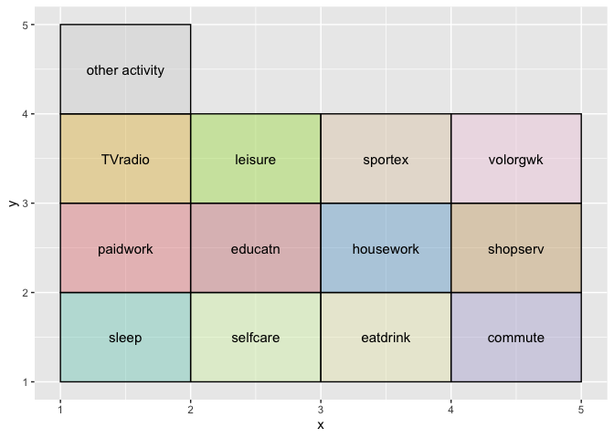<!-- -->

Defining Sequence Object
------------------------

    MyData <- as_tibble(data)

    ## you want to use the full categories of states:
    ## (you need to change if you only focus on specific activities)
    gentime_seq <- seqdef(MyData,
                            var = activities,
                            cnames = t_intervals_labels,
                            alphabet = c("1", "2", "3", "4", "5",
                                         "6", "7", "8","9", "10",
                                         "11", "12", "13"), 
                            labels = c("sleep", "selfcare", 
                                       "eatdrink", "commute",
                                       "paidwork", "educatn", "housework",
                                       "shopserv", "TVradio", "leisure", 
                                       "sportex",
                                       "volorgwk",
                                       "other activity"),
                            cpal = getPalette(colourCount),
                            xtstep = 18, ##step between displayed tick-marks and labels on the time x-axis
                            id = MyData$id)

Weights
-------

If you have weights then add ===&gt; weights = MyData$Weight in your
sequence object definition above.

Check how the sequences look like:

    print(gentime_seq[1:5, ], format = "SPS")

    ##     Sequence                                                                                                   
    ## [1] (1,28)-(2,1)-(3,1)-(4,1)-(10,1)-(5,16)-(1,1)-(3,1)-(9,1)-(1,2)-(5,23)-(3,1)-(9,4)-(2,1)-(10,6)-(1,8)       
    ## [2] (1,24)-(2,1)-(7,6)-(3,2)-(7,7)-(10,4)-(7,3)-(3,3)-(9,2)-(1,4)-(7,14)-(9,2)-(3,4)-(9,4)-(2,2)-(9,7)-(1,7)   
    ## [3] (1,27)-(2,2)-(3,1)-(4,1)-(5,17)-(3,2)-(1,4)-(5,22)-(4,1)-(3,1)-(9,1)-(10,13)-(2,1)-(1,3)                   
    ## [4] (1,23)-(2,1)-(3,1)-(10,3)-(6,20)-(3,2)-(9,2)-(10,18)-(3,2)-(9,8)-(6,11)-(2,1)-(1,4)                        
    ## [5] (1,30)-(2,2)-(3,4)-(7,3)-(10,1)-(9,6)-(7,2)-(3,2)-(10,2)-(1,12)-(7,8)-(3,2)-(10,2)-(11,4)-(9,8)-(2,2)-(1,6)

If you use the “STS” format, it will show each step

Plotting Sequences
------------------

-   sequence index plots

With a small i, the default for idxs is 1:10, plotting the first 10
sequences. If you set idxs to 0, it plots all sequences (might take a
long time).

    seqiplot(gentime_seq, border = NA, with.legend = "right", legend.prop=0.4)

<!-- -->

You can also use the same command with a capital I. It wiil plot all
unless you specify idxs option.

    seqIplot(gentime_seq, border = NA, with.legend = "right", legend.prop=0.4, idxs = 1:4)

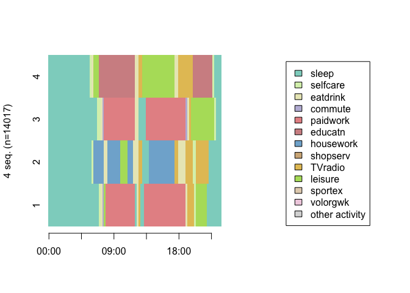<!-- -->

-   the most frequent sequences

Unfortunately, for time-use data, it is usually useless to plot the most
frequent sequences. If you tabulate 4 frequent sequences you will see
what I mean. It is because there are 96 steps there are barely any same
sequences. This command is more useful for shorter sequences with many
commonalities (as in life-course research).

    seqtab(gentime_seq, idxs = 1:4)

    ##                                                                       Freq
    ## 1/24-2/2-3/1-10/1-4/2-6/18-3/2-6/18-4/2-9/4-3/2-11/6-6/6-2/2-1/6         3
    ## 1/24-2/1-10/2-3/1-4/4-5/16-3/1-10/5-5/16-4/4-2/2-3/1-9/3-10/8-9/4-1/4    2
    ## 1/24-2/2-11/4-3/2-8/10-9/6-7/2-3/2-7/1-1/5-9/12-7/2-3/2-9/13-2/2-1/7     2
    ## 1/24-2/2-3/2-4/4-5/16-3/2-1/4-5/18-4/4-2/2-3/2-10/8-1/8                  2
    ##                                                                       Percent
    ## 1/24-2/2-3/1-10/1-4/2-6/18-3/2-6/18-4/2-9/4-3/2-11/6-6/6-2/2-1/6        0.021
    ## 1/24-2/1-10/2-3/1-4/4-5/16-3/1-10/5-5/16-4/4-2/2-3/1-9/3-10/8-9/4-1/4   0.014
    ## 1/24-2/2-11/4-3/2-8/10-9/6-7/2-3/2-7/1-1/5-9/12-7/2-3/2-9/13-2/2-1/7    0.014
    ## 1/24-2/2-3/2-4/4-5/16-3/2-1/4-5/18-4/4-2/2-3/2-10/8-1/8                 0.014

    ## Plot of the 10 most frequent sequences
    seqplot(gentime_seq, type="f", with.legend = "right", legend.prop=0.4)

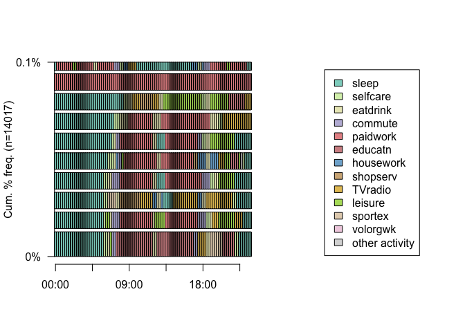<!-- -->

    ##also can plot frequencies using seqfplot
    seqfplot(gentime_seq, border = NA, with.legend = "right", legend.prop=0.4)

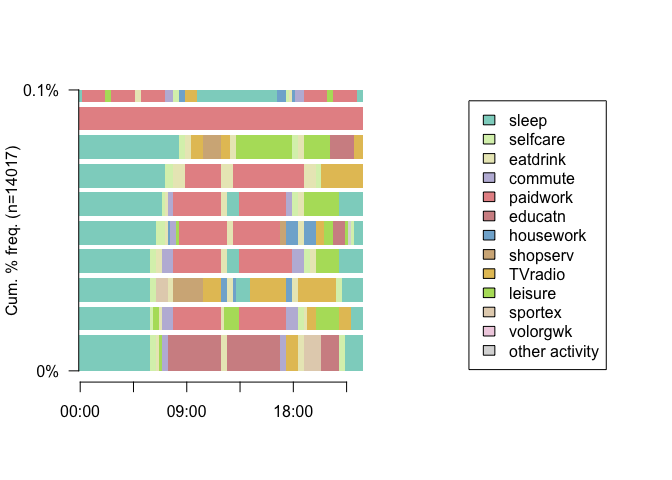<!-- -->

    ##again, frequencies is not very useful for TU seqs
    ##because very few of them repeat themselves with 96 steps

-   tempograms

State distribution plots (aka tempogram aka chronogram) This is an easy
way to plot a tempogram (compared to area plots).

    seqdplot(gentime_seq, border = NA, with.legend = "right", legend.prop=0.4)

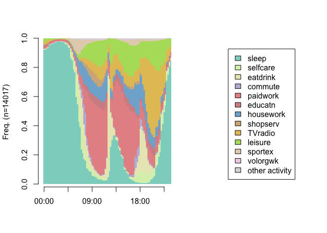<!-- -->

Transitions
-----------

    ## transitions from state to state (in probabilities)
    trate <- seqtrate(gentime_seq)

    ##  [>] computing transition probabilities for states 1/2/3/4/5/6/7/8/9/10/11/12/13 ...

    round(trate, 2)

    ##         [-> 1] [-> 2] [-> 3] [-> 4] [-> 5] [-> 6] [-> 7] [-> 8] [-> 9] [-> 10]
    ## [1 ->]    0.95   0.03   0.00   0.00   0.01   0.00   0.00   0.00   0.00    0.00
    ## [2 ->]    0.08   0.45   0.21   0.02   0.01   0.01   0.06   0.00   0.06    0.05
    ## [3 ->]    0.06   0.02   0.50   0.05   0.04   0.01   0.08   0.01   0.12    0.09
    ## [4 ->]    0.00   0.06   0.08   0.46   0.23   0.03   0.05   0.01   0.02    0.04
    ## [5 ->]    0.00   0.00   0.03   0.02   0.94   0.00   0.00   0.00   0.00    0.00
    ## [6 ->]    0.01   0.01   0.03   0.02   0.00   0.91   0.00   0.00   0.01    0.01
    ## [7 ->]    0.01   0.03   0.10   0.01   0.01   0.00   0.75   0.01   0.04    0.03
    ## [8 ->]    0.00   0.01   0.04   0.01   0.01   0.00   0.08   0.77   0.02    0.05
    ## [9 ->]    0.05   0.03   0.02   0.00   0.00   0.00   0.02   0.00   0.84    0.03
    ## [10 ->]   0.03   0.02   0.03   0.00   0.02   0.00   0.02   0.00   0.03    0.83
    ## [11 ->]   0.00   0.04   0.06   0.00   0.00   0.00   0.03   0.01   0.02    0.03
    ## [12 ->]   0.01   0.01   0.02   0.00   0.00   0.00   0.02   0.00   0.01    0.02
    ## [13 ->]   0.01   0.02   0.04   0.00   0.00   0.00   0.04   0.01   0.02    0.04
    ##         [-> 11] [-> 12] [-> 13]
    ## [1 ->]     0.00     0.0    0.00
    ## [2 ->]     0.03     0.0    0.01
    ## [3 ->]     0.01     0.0    0.00
    ## [4 ->]     0.00     0.0    0.00
    ## [5 ->]     0.00     0.0    0.00
    ## [6 ->]     0.00     0.0    0.00
    ## [7 ->]     0.00     0.0    0.00
    ## [8 ->]     0.00     0.0    0.00
    ## [9 ->]     0.00     0.0    0.00
    ## [10 ->]    0.00     0.0    0.00
    ## [11 ->]    0.80     0.0    0.00
    ## [12 ->]    0.00     0.9    0.00
    ## [13 ->]    0.01     0.0    0.81

    ## heatmap of the transitions matrix
    heatTrate=melt(trate)
    ggplot(heatTrate, aes(Var2, Var1)) +
      geom_tile(aes(fill = value)) +
      geom_text(aes(label = round(value, 2))) +
      scale_fill_continuous(high = "#132B43", low = "#56B1F7", name="Transitions")

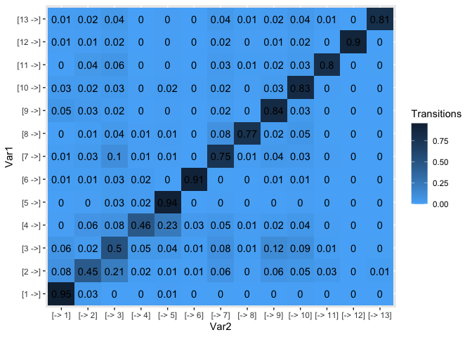<!-- -->

Changing Granularity (Minutes to Hours, etc.)
---------------------------------------------

TraMineR made it very easy to change the number of steps in a sequence.
*seqgranularity* is the command that will help you do it.

To use the first state to represent all, use method = “first”, the last
= “last”, or the most frequent = “mostfreq”.

In the following chunk of code, tspan = 4 means transform to every hour
instead of 15 min.

    gentime4_seq <- seqgranularity(gentime_seq,
                                      tspan=4, method="mostfreq")

    seqdplot(gentime4_seq, border = NA, with.legend = "right", legend.prop=0.4)

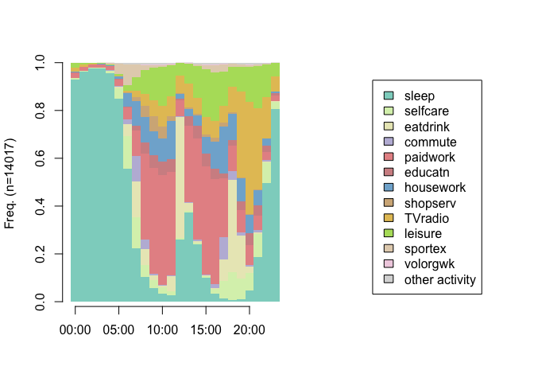<!-- -->

You can see on the tempograms that the granularity decreased and now
each step is an hour.

Modal states sequence
---------------------

    seqplot(gentime_seq, type="ms", with.legend = "right", legend.prop=0.4)

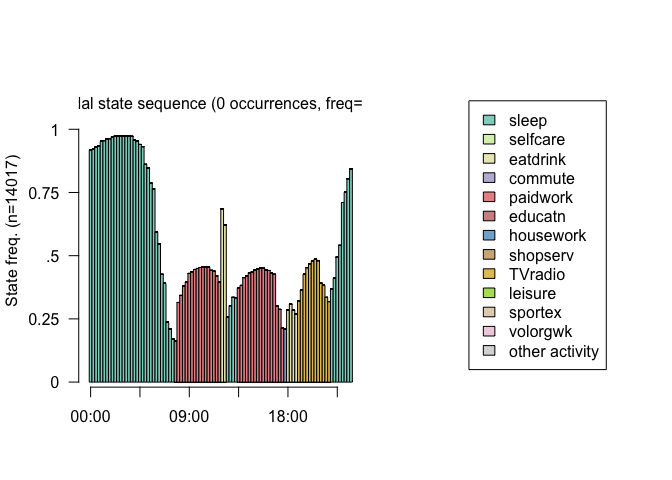<!-- -->

    ## same as
    seqmsplot(gentime4_seq, with.legend = "right", legend.prop=0.4, main="Modal Sequences")

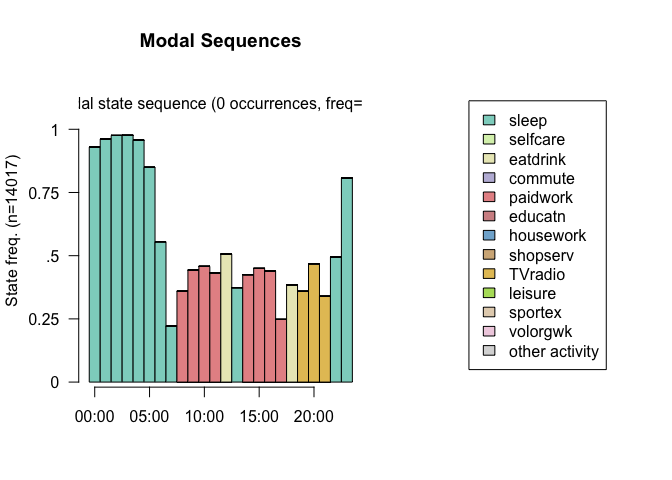<!-- -->

Embrace enthropy
----------------

    seqHtplot(gentime_seq, with.legend = "right", legend.prop=0.4)

<!-- -->

Calculating Dissimilarities
---------------------------

Let’s subset our sequences b/c it’s too big and will take a long time
otherwise.

    data4om<-seqdef(MyData[1:2000,],
                    var = activities,
                    cnames = t_intervals_labels,
                    alphabet = c("1", "2", "3", "4", "5",
                                 "6", "7", "8","9", "10",
                                 "11", "12", "13"), ## notice that I don't have 8 ) you might have it check the data
                    labels = c("sleep", "selfcare", 
                               "eatdrink", "commute",
                               "paidwork", "educatn", "housework",
                               "shopserv", "TVradio", "leisure", 
                               "sportex",
                               "volorgwk",
                               "other activity"),
                    cpal = getPalette(colourCount),
                    xtstep = 18, ##step between displayed tick-marks and labels on the time x-axis
                    id = MyData[1:2000,]$id)

Substitution Cost Matrix
------------------------

We need to define the substitution cost for all the transitions (it can
be a constant or user-defined).

    # seqsubm() = to compute own substitution matrix
    #"TRATE", the costs are determined from the estimated transition rates
    scost <- seqsubm(data4om, method = "TRATE")

    ##  [>] creating substitution-cost matrix using transition rates ...

    ##  [>] computing transition probabilities for states 1/2/3/4/5/6/7/8/9/10/11/12/13 ...

    round(scost, 3)

    ##        1->   2->   3->   4->   5->   6->   7->   8->   9->  10->  11->  12->
    ## 1->  0.000 1.896 1.943 1.998 1.994 1.989 1.982 1.997 1.942 1.965 1.997 1.994
    ## 2->  1.896 0.000 1.756 1.919 1.988 1.985 1.898 1.985 1.906 1.929 1.922 1.997
    ## 3->  1.943 1.756 0.000 1.879 1.932 1.970 1.808 1.943 1.863 1.871 1.917 1.976
    ## 4->  1.998 1.919 1.879 0.000 1.718 1.939 1.930 1.976 1.975 1.948 1.991 2.000
    ## 5->  1.994 1.988 1.932 1.718 0.000 2.000 1.988 1.977 1.994 1.979 1.997 1.997
    ## 6->  1.989 1.985 1.970 1.939 2.000 0.000 1.998 1.999 1.990 1.985 1.997 2.000
    ## 7->  1.982 1.898 1.808 1.930 1.988 1.998 0.000 1.899 1.941 1.945 1.960 1.979
    ## 8->  1.997 1.985 1.943 1.976 1.977 1.999 1.899 0.000 1.974 1.944 1.991 1.996
    ## 9->  1.942 1.906 1.863 1.975 1.994 1.990 1.941 1.974 0.000 1.937 1.984 1.994
    ## 10-> 1.965 1.929 1.871 1.948 1.979 1.985 1.945 1.944 1.937 0.000 1.959 1.964
    ## 11-> 1.997 1.922 1.917 1.991 1.997 1.997 1.960 1.991 1.984 1.959 0.000 1.994
    ## 12-> 1.994 1.997 1.976 2.000 1.997 2.000 1.979 1.996 1.994 1.964 1.994 0.000
    ## 13-> 1.995 1.981 1.959 1.996 1.996 2.000 1.959 1.995 1.975 1.960 1.990 1.997
    ##       13->
    ## 1->  1.995
    ## 2->  1.981
    ## 3->  1.959
    ## 4->  1.996
    ## 5->  1.996
    ## 6->  2.000
    ## 7->  1.959
    ## 8->  1.995
    ## 9->  1.975
    ## 10-> 1.960
    ## 11-> 1.990
    ## 12-> 1.997
    ## 13-> 0.000

    ## calculated in this way, all are close to 2 anyway (for this dataset) 2 is default
    ## or we can use the usual default one of constant 2:
    ccost <- seqsubm(data4om, method="CONSTANT", cval=2)

    ##  [>] creating 13x13 substitution-cost matrix using 2 as constant value

    round(ccost, 3)

    ##      1-> 2-> 3-> 4-> 5-> 6-> 7-> 8-> 9-> 10-> 11-> 12-> 13->
    ## 1->    0   2   2   2   2   2   2   2   2    2    2    2    2
    ## 2->    2   0   2   2   2   2   2   2   2    2    2    2    2
    ## 3->    2   2   0   2   2   2   2   2   2    2    2    2    2
    ## 4->    2   2   2   0   2   2   2   2   2    2    2    2    2
    ## 5->    2   2   2   2   0   2   2   2   2    2    2    2    2
    ## 6->    2   2   2   2   2   0   2   2   2    2    2    2    2
    ## 7->    2   2   2   2   2   2   0   2   2    2    2    2    2
    ## 8->    2   2   2   2   2   2   2   0   2    2    2    2    2
    ## 9->    2   2   2   2   2   2   2   2   0    2    2    2    2
    ## 10->   2   2   2   2   2   2   2   2   2    0    2    2    2
    ## 11->   2   2   2   2   2   2   2   2   2    2    0    2    2
    ## 12->   2   2   2   2   2   2   2   2   2    2    2    0    2
    ## 13->   2   2   2   2   2   2   2   2   2    2    2    2    0

Optimal Matching
----------------

Optimal matching for calculating dissimilarities between sequences need
the specification of both substitution and indel costs. The algorithm is
developed by Needleman and Wunsch (1970). For the illustration how the
algorithm works please link to [my explanation of optimal
matching](https://blogs.ubc.ca/kamilakolpashnikova/optimal-matching-algorithm-interactive-app-for-social-scientists/)

If the sequence file is heavy, calculate only the upper part of the
matrix by full.matrix = FALSE The usual default is that substitution
cost is twice the indel cost, and default indel cost is 1.

    om_gentime <- seqdist(data4om, method = "OM", indel = 1, sm = scost)

    ##  [>] 2000 sequences with 13 distinct states

    ##  [>] checking 'sm' (size and triangle inequality)

    ##  [>] 1998 distinct  sequences

    ##  [>] min/max sequence lengths: 96/96

    ##  [>] computing distances using the OM metric

    ##  [>] elapsed time: 29.715 secs

    ## this results in a dissimilarity matrix which you can look at using:
    round(om_gentime[1:10, 1:10], 1)

    ##        [,1]  [,2]  [,3]  [,4]  [,5]  [,6]  [,7]  [,8]  [,9] [,10]
    ##  [1,]   0.0 102.8  27.0 111.4  98.9 103.3  39.1  43.5  91.5  97.1
    ##  [2,] 102.8   0.0 114.7  98.6  64.4  56.2  86.8 114.8  78.0  70.2
    ##  [3,]  27.0 114.7   0.0 101.8 104.6 112.7  45.6  52.9  93.3  91.9
    ##  [4,] 111.4  98.6 101.8   0.0  98.6 102.3 116.8 125.0  79.1  70.0
    ##  [5,]  98.9  64.4 104.6  98.6   0.0  54.6  91.3 115.2  75.4  56.9
    ##  [6,] 103.3  56.2 112.7 102.3  54.6   0.0  85.2 113.3  75.5  62.6
    ##  [7,]  39.1  86.8  45.6 116.8  91.3  85.2   0.0  47.3  94.4  89.3
    ##  [8,]  43.5 114.8  52.9 125.0 115.2 113.3  47.3   0.0 118.2 117.1
    ##  [9,]  91.5  78.0  93.3  79.1  75.4  75.5  94.4 118.2   0.0  40.7
    ## [10,]  97.1  70.2  91.9  70.0  56.9  62.6  89.3 117.1  40.7   0.0

Cluster Analysis
----------------

Let’s run cluster analysis on our dissimilarity matrix

Other common methods are:

-   “average”,
-   “single”,
-   “complete”

The “average” and “single” options do not work well for time-use data
(check). The “complete” option is a possibility (check).

    clusterward <- agnes(om_gentime, diss = TRUE, method = "ward")

    # Convert hclust into a dendrogram and plot
    hcd <- as.dendrogram(clusterward)

    # Default plot
    plot(hcd, type = "rectangle", ylab = "Height")

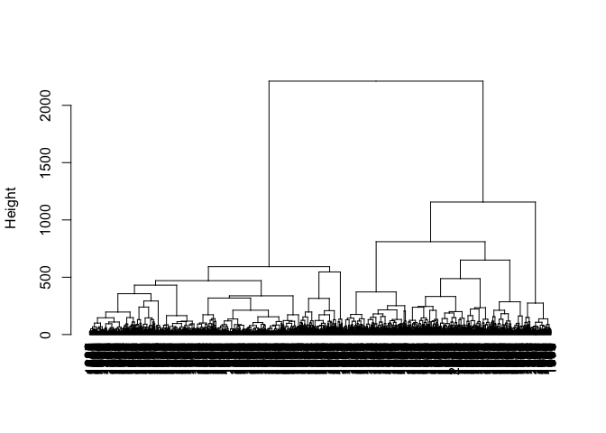<!-- -->

How good is our clustering?
---------------------------

Let’s inspect the splitting tree branches:

    ward.tree <- as.seqtree(clusterward, seqdata = data4om, 
                                diss = om_gentime, 
                                ncluster = 25)
    seqtreedisplay(ward.tree, type = "d", border = NA, show.depth = TRUE) 

Test the cluster solution quality:

There are many possible tests:

-   PBC. Point Biserial Correlation. Correlation between the given
    distance matrice and a distance which equal to zero for individuals
    in the same cluster and one otherwise.
-   HG. Hubert’s Gamma. Same as previous but using Kendall’s Gamma
    coefficient.
-   HGSD. Hubert’s Gamma (Somers’D). Same as previous but using Somers’
    D coefficient.
-   ASW. Average Silhouette width (observation).
-   ASWw. Average Silhouette width (weighted).
-   CH. Calinski-Harabasz index (Pseudo F statistics computed from
    distances).
-   R2. Share of the discrepancy explained by the clustering solution.
-   CHsq. Calinski-Harabasz index (Pseudo F statistics computed from
    squared distances).
-   R2sq. Share of the discrepancy explained by the clustering solution
    (computed using squared distances).
-   HC. Hubert’s C coefficient.
-   ASW. The Average Silhouette Width of each cluster, one column for
    each ASW measure.

<!-- -->

    wardtest <- as.clustrange(clusterward,
                             diss = om_gentime, 
                              ncluster = 25)

    #plot the quality criteria
    plot(wardtest, stat = c("ASW", "HC", "PBC"), norm = "zscore", lwd = 4)

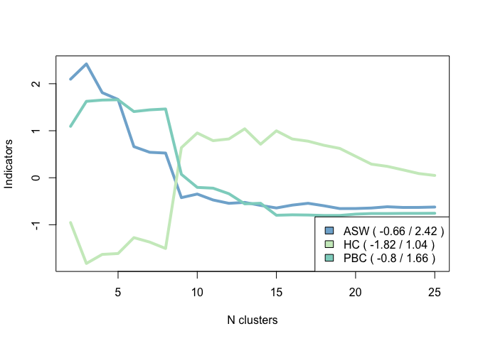<!-- -->

Let’s say that our solution is pretty good for 10 clusters.

1.  Cut the tree

<!-- -->

    MyData<-MyData[1:2000,]
    c10 <- cutree(clusterward, k = 10)
    MyData<-cbind(MyData, c10)

1.  Plot the cluster solution (will save in the working directory)

<!-- -->

    png("test.png", 1200, 800)
    seqdplot(data4om, group = c10, border = NA)
    dev.off()

    ## quartz_off_screen 
    ##                 2

How to plot a cluster
---------------------

    # subset data by cluster
    cl1<-(data4om[MyData$c10 ==  "1",])

    # plot the selected cluster 
    par(mfrow=c(1,1))
    seqdplot(cl1, main = "",
             cex.main = 1.7, 
             with.legend = FALSE, 
             yaxis = FALSE, 
             cpal = getPalette(colourCount), 
             ylab = "",
             border = NA)

<!-- -->

Multinomial Regression on the Clusters
--------------------------------------

For more details please consult the nnet library documents.

    # Format categorical variables
    MyData$c10 <- factor(MyData$c10)

    # Set the reference group for c1 to be 1
    MyData$c10 <- relevel(MyData$c10, ref=1)

    # Run the model
    model <- multinom(c10~URBAN+SEX+CARER+factor(INCOME), data=MyData, na.action=na.omit)

    ## # weights:  70 (54 variable)
    ## initial  value 4605.170186 
    ## iter  10 value 3978.416921
    ## iter  20 value 3820.233315
    ## iter  30 value 3792.004176
    ## iter  40 value 3788.498862
    ## iter  50 value 3788.224688
    ## final  value 3788.173142 
    ## converged

    summary(model)

    ## Call:
    ## multinom(formula = c10 ~ URBAN + SEX + CARER + factor(INCOME), 
    ##     data = MyData, na.action = na.omit)
    ## 
    ## Coefficients:
    ##    (Intercept)       URBAN         SEX       CARER factor(INCOME)2
    ## 2  -0.47524644 -0.95049287  2.19792833 -0.19445955     -2.92064182
    ## 3   0.17201334  0.34402668 -0.05523851 -1.58916309     -4.53241404
    ## 4   0.08976155  0.17952310  0.59688916 -0.91018874     -2.83445333
    ## 5  -0.09497928 -0.18995857  0.71709282  0.29451989     -0.22804476
    ## 6  -0.34958148 -0.69916296  0.69980755  0.07258691     -0.04096822
    ## 7   0.04498650  0.08997299  0.09280728 -0.03466378     -2.12663410
    ## 8   0.11185861  0.22371723 -0.25271608 -0.23571864     -2.25272793
    ## 9   0.02437480  0.04874960  0.18723828 -0.11672264     -1.50530122
    ## 10 -0.86272744 -1.72545488  0.56702832  0.11053183      1.27961030
    ##    factor(INCOME)3
    ## 2       -2.2294729
    ## 3       -3.8531686
    ## 4       -2.8519348
    ## 5       -0.3520447
    ## 6       -0.0659749
    ## 7       -1.3881432
    ## 8       -2.1526704
    ## 9       -1.7064761
    ## 10       0.7402751
    ## 
    ## Std. Errors:
    ##    (Intercept)     URBAN       SEX     CARER factor(INCOME)2 factor(INCOME)3
    ## 2   0.08387629 0.1677526 0.2256244 0.2379737       0.2726399       0.2871771
    ## 3   0.07806186 0.1561237 0.2415339 0.4542170       0.6060797       0.5388616
    ## 4   0.06666614 0.1333323 0.1934753 0.2715106       0.2545137       0.3052396
    ## 5   0.05915593 0.1183119 0.1596294 0.1796690       0.1924712       0.2130789
    ## 6   0.08243269 0.1648654 0.2159840 0.2529127       0.2664374       0.2947743
    ## 7   0.07453740 0.1490748 0.2210264 0.2544485       0.2752676       0.2635221
    ## 8   0.08101114 0.1620223 0.2522141 0.3026507       0.3022829       0.3339813
    ## 9   0.07226015 0.1445203 0.2109154 0.2516178       0.2381349       0.2821039
    ## 10  0.20404181 0.4080836 0.4417865 0.5247891       0.7691662       0.8449591
    ## 
    ## Residual Deviance: 7576.346 
    ## AIC: 7666.346

    ##Multinomial logit model: relative risk ratios
    # Relative risk ratios allow an easier interpretation of the logit coefficients. 
    #They are the exponentiatedvalue of the logit coefficients.

    multi1.rrr = exp(coef(model))
    multi1.rrr

    ##    (Intercept)     URBAN       SEX     CARER factor(INCOME)2 factor(INCOME)3
    ## 2    0.6217318 0.3865505 9.0063360 0.8232795      0.05389908      0.10758512
    ## 3    1.1876937 1.4106163 0.9462594 0.2040964      0.01075468      0.02121242
    ## 4    1.0939134 1.1966466 1.8164593 0.4024483      0.05875063      0.05773251
    ## 5    0.9093918 0.8269934 2.0484693 1.3424817      0.79608862      0.70324870
    ## 6    0.7049831 0.4970011 2.0133652 1.0752863      0.95985963      0.93615436
    ## 7    1.0460137 1.0941447 1.0972503 0.9659301      0.11923796      0.24953822
    ## 8    1.1183547 1.2507173 0.7766884 0.7900029      0.10511209      0.11617351
    ## 9    1.0246743 1.0499574 1.2059146 0.8898320      0.22195043      0.18150428
    ## 10   0.4220095 0.1780920 1.7630201 1.1168719      3.59523839      2.09651223

[1] University of Oxford
